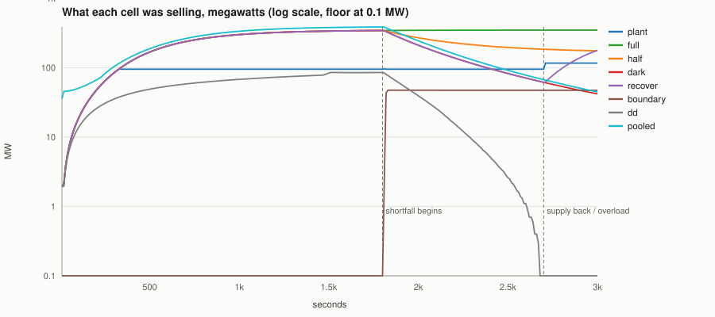
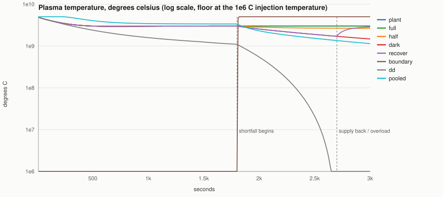
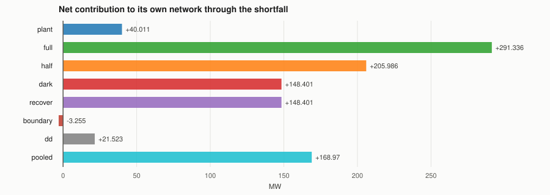

# The brownout and blackout measurements

**Generated by `scripts/check-brownout.ps1 -Report`. Do not edit: every run overwrites it.**
Rendered 2026-08-20 from one run against Factorio 2.0.77, base 2.0 only.
Verdict: **PASS: 24 checks, 0 failures**

```
pwsh -File scripts/check-brownout.ps1 -Settle 1800 -Cut 900 -Restore 300 -Thin 0.025 -Report docs\research\brownout-rig.md
```

This is the rig half of [#70](https://github.com/trulsjo/realistic-fusion-refreshed/issues/70). The
question was whether losing a D-T reactor to a brownout should be survivable, on a premise that a
brownout cools the plasma, which cuts the output, which deepens the brownout. **The premise does not
hold.** A D-T reactor at the shipped numbers is ignited: it needs its confinement heating to get to a
fusing temperature and not to stay at one, so a shortfall costs it output slowly and costs its network
nothing at all.

Every number below is measured in a running game, on eight independent cells, and drawn from the same
trace the rig's own assertions are computed from. Balance in this repository is provisional, so the
figures move when the balance does -- which is the reason this file is generated rather than written.

## The phases

| | ticks | seconds | what happens |
|---|---:|---:|---|
| settle | 108000 | 1800 | every cell supplied; reactors light and build density |
| shortfall | 54000 | 900 | each cell takes its own cut -- see the cells below |
| after | 18000 | 300 | `recover` gets its supply back; `plant` is overloaded |

## The cells

Eight, each on its own electric network and its own plasma segment, each a reactor with its own
`rf-heater` feeding it -- so undersupplying a network throttles the fuel line and the confinement
heating together, in the engine's proportions rather than in ones the rig chose.

| cell | what it is | its cut |
|---|---|---|
| `full` | D-T reactor and heater | none -- the baseline |
| `half` | the same | supply to half of what the cell was measured to draw |
| `dark` | the same | supply to zero, never restored |
| `recover` | the same | supply to zero, then back at the end of the shortfall |
| `boundary` | a reactor with no heater and no feed | none; instead one thin cold charge, seeded by hand |
| `plant` | reactor, heater, `rf-hc-exchanger`, two `rf-hc-turbines`, load bank | starter switched off, then overloaded past what it can make |
| `dd` | D-D reactor and heater | supply to zero, on the same tick as `dark` |
| `pooled` | two D-T reactors bridged by `rf-pipe`, one heater | supply to zero, on the same tick as `dark` |

## What each cell was selling



Log scale, floored at a tenth of a megawatt, because the eight cells end up four orders of magnitude
apart. The two rules are the phase boundaries. `full` is the only cell that keeps its supply throughout, and
`dark`, `dd` and `pooled` lose theirs entirely at the first rule -- so the distance between
`full` and `dark` after that rule is the whole of what a blackout costs. `plant` is read at its
turbines rather than at its reactor, because a real exchanger is drinking its output.

## Plasma temperature



Log scale, floored at the temperature plasma is injected at -- below that there is nothing to draw, and
a box with no plasma in it reads on the floor. The D-T cells fall off the clamp when their power goes and then flatten:
that flattening is ignition, and it is the answer to the ticket. `dd` does not flatten -- a D-D plasma
at this density was never carrying itself, so it falls all the way.

## Net contribution through the shortfall



What each cell gave its own network minus what it took from it, averaged over the shortfall. Seven of
eight are positive. The one that is not is `boundary`, which had to be handed a thin cold charge by
hand: no amount of losing power got any other cell into that state.

## The readings

| cell | MW lit | MW at the end | ratio | net MW | C at the end | units |
|---|---:|---:|---:|---:|---:|---:|
| `plant` | 95.17 | 95.17 | 100% | +40.01 | 1.999e+9 | 270.3 |
| `full` | 322.37 | 324.28 | 100.6% | +268.67 | 1.999e+9 | 270.3 |
| `half` | 322.37 | 166.23 | 51.6% | +178.02 | 1.961e+9 | 191.5 |
| `dark` | 322.37 | 49.47 | 15.3% | +123.65 | 9.479e+8 | 93.5 |
| `recover` | 322.37 | 49.47 | 15.3% | +123.65 | 9.479e+8 | 93.5 |
| `boundary` | 0 | 42.99 | -- | -7.11 | 2e+9 | 10.9 |
| `dd` | 70.58 | 0.32 | 0.4% | +14.46 | 3.452e+6 | 625.9 |
| `pooled` | 364.12 | 49.1 | 13.5% | +132.19 | 6.607e+8 | 65.6 |

"MW lit" is measured over the last minute of the settle phase and "MW at the end" over the last minute
of the shortfall, so the ratio is what the cell still had by the end of its cut. `full` and `plant`
keep their supply throughout, so their ratios sit at about 100% and are the control: whatever the other
cells lost, they lost it to the shortfall and not to the clock. "net MW" is output minus draw, averaged
across the whole shortfall.

The rig asserts that `full`'s output had stopped climbing before the shortfall began, because every
ratio in this column divides by it. `dd` is the one cell deliberately left unconverged -- a D-D plasma
never ignites, so it climbs on temperature as well as density and would need far longer; that makes its
own "kept" figure an understatement, so the tier gap below is narrower than the truth rather than wider.

## What the rig asserted

| | check | measured |
|---|---|---|
| pass | engine power figures are joules per tick, so watts convert by sixty | vanilla steam-turbine reads 5.82 MW that way |
| pass | the map is stopped from fighting back, so a long run measures the reactor | pollution and expansion off, peaceful, 10 enemy entities removed |
| pass | the eight cells are on eight independent electric networks | 8 distinct network ids |
| pass | an electric network's consumption is readable, and which category holds it is derived | input; a satisfied reactor drew 8.991e+04 MJ in 1800s against an appetite of 1.08e+05 MJ |
| pass | full: a heater-fed D-T reactor ignites and parks at the top of its range | 2e+09 C against a ceiling of 2e+09 |
| pass | full: and pays for its own confinement heating many times over | 2.914e+05 MJ sold against 4.965e+04 MJ drawn, 5.87x |
| pass | full: and its output had stopped climbing before the shortfall, so the baseline is settled | 321.9 MW over the minute before last against 322.4 MW over the last, +0.15% -- raise -Settle if this fails |
| pass | full: and the shortfall is graded, so the supply figure is what decides what a cell gets | full drew 55.17 MW, half 27.57 MW, blackout 0 MW |
| pass | half: a lit reactor is a net contributor throughout the shortfall, not a drain | +1.602e+05 MJ net (+178 MW), sold 1.85e+05 against 2.481e+04 drawn |
| pass | dark: a lit reactor is a net contributor throughout the shortfall, not a drain | +1.113e+05 MJ net (+123.6 MW), sold 1.113e+05 against 0 drawn |
| pass | pooled: a lit reactor is a net contributor throughout the shortfall, not a drain | +1.189e+05 MJ net (+132.2 MW), sold 1.189e+05 against 0 drawn |
| pass | half: and at half supply it is still fusing at the end of the shortfall | 1.962e+09 C, 191.4 u, heater low_power |
| pass | dark: a blacked-out reactor keeps selling energy it is no longer being paid to make | +1.659e+04 MJ net over the first minute (+276.5 MW) |
| pass | dark: and it is decaying the whole way, so nothing here is a reactor that stopped needing fuel | 322.4 MW lit, 49.46 MW at the end of 900s of blackout (15.3%), 9.476e+08 C left |
| pass | recover: the supply comes back and the reactor re-ignites with no help of any kind | 2e+09 C, 192.9 u, 300.0s after the supply returned |
| pass | recover: and coming back never costs more than a fraction of what it draws | +1.764e+04 MJ net over the 300s it took (+58.79 MW) against 1.656e+04 MJ drawn -- net positive throughout, so re-igniting cost nothing at all |
| pass | boundary: the charge really did land thin, so the cell is measuring what it was built to | 22.75 u of 1000 (2.28%), seeded at 2.50% and cold |
| pass | boundary: a reactor holding plasma too thin to carry itself is a net drain | -6397 MJ net (-7.107 MW) -- the only cell in this rig where the sign is negative |
| pass | plant: with its starter switched off the plant carries its own confinement heating | 2e+09 C, turbine working, heater working |
| pass | plant: and overloading it past what it can make does not make it eat itself | 2e+09 C at 200 MW of load, turbine working, heater working |
| pass | dd: the same heater buys less from a D-D reactor than from a D-T one | 9.402e+04 MJ against 4.185e+05 MJ over the settle phase, 4.45x |
| pass | dd: and it fades far further through the same blackout than the D-T reactor does | D-D keeps 0.44% of its lit output (70.58 to 0.3127 MW), D-T keeps 15.3% |
| pass | pooled: both reactors on the shared pool still hold plasma at the end of the blackout | 6.605e+08 C and 6.605e+08 C |
| pass | pooled: and they share the fall rather than one starving the other | spread 4992 C, 0.0% of the hotter |

## Reproducing it

```
pwsh -File scripts/check-brownout.ps1 -Settle 1800 -Cut 900 -Restore 300 -Thin 0.025 -Report docs\research\brownout-rig.md
```

Cells, instrument and the two undocumented engine conventions the measurements rest on are all
documented in `scripts/check-brownout.ps1`'s own header. `tests/test-reactor-logic.lua` asserts the
same behaviour outside Factorio, in about a second, and is the cheap guard; this is the expensive one.
