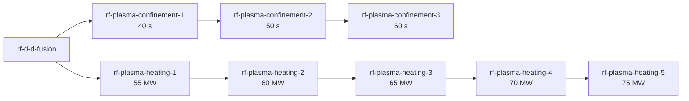

# D-T ignites, and what that costs

## Current figures

Each row is a figure this note currently stands behind, copied from the section named. A change to
a figure below changes its row here in the same commit (docs/agents/code-review.md).

| Figure | Value | Measured | Game version | Research state | Section |
|---|---|---|---|---|---|
| Largest D-T over D-D reactivity ratio, at 1×10⁸ K | 93× | 2026-08-17 | none (pure simulation) | n/a | [What the data says](#what-the-data-says) |
| D-T energy advantage per reaction over D-D's mean | 4.8× | 2026-08-17 | none (pure simulation) | n/a | [What the data says](#what-the-data-says) |
| D-D settled temperature, 20 min, with radiation (#52) | 2.42×10⁸ °C | not stated | not stated | not stated | [The equilibrium that isn't](#the-equilibrium-that-isnt) |
| D-D Q with radiation (#52) | 0.3205 | 2026-08-21 | not stated | not stated | [Both of those are settled, 2026-08-25 (#57, #58, ADR 0025)](#both-of-those-are-settled-2026-08-25-57-58-adr-0025) |
| D-D fusion power with radiation (#52) | 16.02 MW | 2026-08-21 | not stated | not stated | [Both of those are settled, 2026-08-25 (#57, #58, ADR 0025)](#both-of-those-are-settled-2026-08-25-57-58-adr-0025) |
| D-D thermal sold at the settled point, against the 50 MW it draws | 56.1 MW | 2026-08-21 | not stated | not stated | [Both of those are settled, 2026-08-25 (#57, #58, ADR 0025)](#both-of-those-are-settled-2026-08-25-57-58-adr-0025) |
| Plasma temperature ceiling (the clamp) | 5×10⁹ °C | 2026-08-25 | not stated | n/a | [Both of those are settled, 2026-08-25 (#57, #58, ADR 0025)](#both-of-those-are-settled-2026-08-25-57-58-adr-0025) |
| Reach of the temperature signal in kilodegrees (#57) | about 2.1×10¹² °C | 2026-08-25 | not stated | n/a | [Both of those are settled, 2026-08-25 (#57, #58, ADR 0025)](#both-of-those-are-settled-2026-08-25-57-58-adr-0025) |
| D-T Q at 30 s of confinement, with radiation, quoted beside 3.25×10⁹ °C | 73.1 | 2026-08-25 | none (pure simulation) | unresearched (30 s of confinement) | [The equilibrium that isn't](#the-equilibrium-that-isnt) |
| D-T temperature at the top confinement rung, with radiation | 3.92×10⁹ °C | 2026-08-25 | none (pure simulation) | top confinement rung; heating not stated | [The equilibrium that isn't](#the-equilibrium-that-isnt) |
| D-T Q at the top confinement rung, with radiation | 65.4 | 2026-08-25 | none (pure simulation) | top confinement rung; heating not stated | [The equilibrium that isn't](#the-equilibrium-that-isnt) |
| D-T temperature `scripts/check-d-t.ps1` sees in game | 3.13×10⁹ °C | 2026-08-25 | 2.0.77 | not stated | [Both of those are settled, 2026-08-25 (#57, #58, ADR 0025)](#both-of-those-are-settled-2026-08-25-57-58-adr-0025) |
| D-T temperature and burn at one minute, with radiation | 3.25×10⁹ °C and 26.0 u/s | not stated | none (pure simulation) | unresearched — 30 s, 50 MW | [Both readings of the supply ratio](#both-readings-of-the-supply-ratio) |
| D-T temperature and burn settled (twenty minutes), with radiation | 3.27×10⁹ °C and 25.9 u/s | not stated | none (pure simulation) | unresearched — 30 s, 50 MW | [Both readings of the supply ratio](#both-readings-of-the-supply-ratio) |
| One-heater D-D output, in game, 870 000 ticks, fuel line finished cooling (#503) | 48.3 – 58.0 MW | 2026-10-03 | not stated | unresearched | [Ignition is a control change, not a runaway](#ignition-is-a-control-change-not-a-runaway) |
| One-heater D-T output, in game, 252 000 ticks (#486) | 282.1 – 338.5 MW | 2026-10-02 | 2.0.77 | unresearched | [Ignition is a control change, not a runaway](#ignition-is-a-control-change-not-a-runaway) |
| One-heater D-T box fill and temperature, in game, reproducible (#510, #518) | 275.6 units at 2.193×10⁹ °C | 2026-10-03 | 2.0.77 | unresearched | [Ignition is a control change, not a runaway](#ignition-is-a-control-change-not-a-runaway) |
| Fed model (`M.settle_fed`) at 2.5 u/s of D-T plasma | 276.9 units and 2.183×10⁹ °C, burning 2.500 u/s and selling 322.7 MW | not stated | none (pure simulation) | not stated | [Ignition is a control change, not a runaway](#ignition-is-a-control-change-not-a-runaway) |
| One-heater D-T output, in game, 126 000 ticks, fully researched | 321.0 – 385.2 MW at 313.9 units and 3.446×10⁹ °C | not stated | not stated | all ladders complete | [Ignition is a control change, not a runaway](#ignition-is-a-control-change-not-a-runaway) |
| Exchangers covering a one-heater D-T reactor | four unresearched (3.1 to 3.8 machines' worth), four or five researched (3.6 to 4.3) | not stated | not stated | both, as labelled | [Ignition is a control change, not a runaway](#ignition-is-a-control-change-not-a-runaway) |
| Turbines for a one-heater D-T reactor, at 5.82 MW a turbine | 49 to 59 unresearched, 56 to 67 researched | not stated | not stated | both, as labelled | [Ignition is a control change, not a runaway](#ignition-is-a-control-change-not-a-runaway) |
| Supply ratio per heater | 9.12 D-D reactors | not stated | none (pure simulation) | unresearched — 30 s, 50 MW | [Both readings of the supply ratio](#both-readings-of-the-supply-ratio) |
| Supply ratio per heater | 0.973 D-D reactors | not stated | none (pure simulation) | fully researched — 60 s, 75 MW | [Both readings of the supply ratio](#both-readings-of-the-supply-ratio) |
| Supply ratio per saturated reactor | 94.7 D-D reactors | not stated | none (pure simulation) | unresearched — 30 s, 50 MW | [Both readings of the supply ratio](#both-readings-of-the-supply-ratio) |
| Supply ratio per saturated reactor | 8.93 D-D reactors | not stated | none (pure simulation) | fully researched — 60 s, 75 MW | [Both readings of the supply ratio](#both-readings-of-the-supply-ratio) |
| Supply ratio per saturated reactor, top confinement rung only | 18.50 D-D reactors | not stated | none (pure simulation) | 60 s `confinement-3`, 50 MW shipped heating | [What research does to it: two ladders, and a grid rather than a line](#what-research-does-to-it-two-ladders-and-a-grid-rather-than-a-line) |
| Heaters a settled D-T reactor eats | 10.4 heaters | not stated | none (pure simulation) | unresearched — 30 s, 50 MW | [Both readings of the supply ratio](#both-readings-of-the-supply-ratio) |
| Heaters a settled D-T reactor eats | 9.18 heaters | not stated | none (pure simulation) | fully researched — 60 s, 75 MW | [Both readings of the supply ratio](#both-readings-of-the-supply-ratio) |
| Tritium a settled D-T reactor burns | 12.97 u/s | not stated | none (pure simulation) | unresearched — 30 s, 50 MW | [Both readings of the supply ratio](#both-readings-of-the-supply-ratio) |
| Tritium a settled D-T reactor burns | 11.47 u/s | not stated | none (pure simulation) | fully researched — 60 s, 75 MW | [Both readings of the supply ratio](#both-readings-of-the-supply-ratio) |
| Tritium a settled D-D reactor breeds | 0.137 u/s | not stated | none (pure simulation) | unresearched — 30 s, 50 MW | [Both readings of the supply ratio](#both-readings-of-the-supply-ratio) |
| Tritium a settled D-D reactor breeds, top confinement rung at base heating | 0.627 u/s | not stated | none (pure simulation) | 60 s, 50 MW | [What research does to it: two ladders, and a grid rather than a line](#what-research-does-to-it-two-ladders-and-a-grid-rather-than-a-line) |
| Tritium a settled D-D reactor breeds, top heating rung at entry confinement | 0.393 u/s | not stated | none (pure simulation) | 30 s, 75 MW | [What research does to it: two ladders, and a grid rather than a line](#what-research-does-to-it-two-ladders-and-a-grid-rather-than-a-line) |
| Output per reactor, 94.7 D-D reactors feeding one D-T reactor | 88.5 MW each (8 465 MW from 95.7 reactors) | not stated | none (pure simulation) | unresearched — 30 s, 50 MW | [Both readings of the supply ratio](#both-readings-of-the-supply-ratio) |
| What one heating rung is worth to the supply ratio | −24% at entry confinement and −8% at the top one | not stated | none (pure simulation) | as labelled | [What research does to it: two ladders, and a grid rather than a line](#what-research-does-to-it-two-ladders-and-a-grid-rather-than-a-line) |
| Supply ratio per heater on the D-He3 mix, and on bare helium-3 | 9.12 and 18.2 | not stated | none (pure simulation) | not stated | [Both readings of the supply ratio](#both-readings-of-the-supply-ratio) |
| Blanket breeding ratio, in game by `scripts/check-blanket.ps1`, against the model's 1.1 (#30) | 1.1000 | 2026-08-17 | not stated | not stated | [What research does to it: two ladders, and a grid rather than a line](#what-research-does-to-it-two-ladders-and-a-grid-rather-than-a-line) |
| D-T plasma in the fuel segment beside the box, three pipes, one heater, 300 000 ticks (#532) | 334.9 units beside 275.7 in the box | 2026-10-04 | 2.0.77 | unresearched | [In the game](#in-the-game-1) |
| D-T plasma in the fuel segment beside the box, six pipes, one heater, 300 000 ticks (#532) | 417.9 units beside 275.8 in the box | 2026-10-04 | 2.0.77 | unresearched | [In the game](#in-the-game-1) |
| Brownout rig's own fuel line, 32 `rf-pipe`, one heater, tick 108 001 (#546) | a segment capacity of 4200 holding 1282.82 units, beside 312.48 in the box | 2026-10-04 | 2.0.77 | all ladders complete | [In the game](#in-the-game-1) |

Measured 2026-08-17 while implementing
[#28](https://github.com/trulsjo/realistic-fusion-refreshed/issues/28). Everything here comes from
`scripts/reactor-logic.lua` driven at the shipped `M.reactor` constants, and from
`scripts/check-d-t.ps1` running the same reactors in Factorio 2.0.77.

The short version: **D-D settles and D-T does not.** That is the difference between the two tiers,
and it is a property of the cross-section data and the reactor's confinement, not a balance number
anyone chose.

## What the data says

Maxwellian-averaged reactivity ⟨σv⟩ in m³/s, from `cross-section-data/reactivities.lua`:

| Plasma temperature | D-D | D-T | ratio |
|---|---|---|---|
| 1×10⁷ K | 8.39×10⁻²⁹ | 2.70×10⁻²⁷ | 32× |
| 5×10⁷ K | 1.15×10⁻²⁵ | 7.87×10⁻²⁴ | 69× |
| 1×10⁸ K | 8.25×10⁻²⁵ | 7.65×10⁻²³ | **93×** |
| 3×10⁸ K | 7.98×10⁻²⁴ | 5.87×10⁻²² | 74× |
| 6×10⁸ K | 2.27×10⁻²³ | 8.73×10⁻²² | 39× |
| 1×10⁹ K | 4.26×10⁻²³ | 8.72×10⁻²² | 20× |
| 2×10⁹ K | 8.64×10⁻²³ | 6.82×10⁻²² | 7.9× |
| 5×10⁹ K | 1.76×10⁻²² | 3.99×10⁻²² | 2.3× |

D-T's advantage is largest *low down* and narrows as both curves approach their peaks. That is why
D-T is the **easier** reaction rather than merely the bigger one: it is what a reactor can still run
on where D-D has fallen off the bottom of its curve. Multiply through by 17.59 MeV against D-D's
mean 3.65 and the energy advantage is another 4.8×.

Two corrections apply before those numbers become a rate, and both are per-fuel rather than per-
reaction:

- **D-D is like-species.** Every nucleus in the box is both reactants, and each pair would otherwise
  be counted twice, so `reactivity.rate` carries a factor of one half. That was already there.
- **D-T is a mixture.** A fluid unit is a count of nuclei, and in an even blend each side sits at
  *half* the plasma's density — so the rate is a quarter of what feeding the whole density twice
  would give. This is what `M.fuels[...].fractions` is, added by #28. Getting it wrong quadruples
  the tier's output and nothing else in the model notices, which is why
  `tests/test-reactor-logic.lua` recomputes one rate straight from the dataset rather than asserting
  a ratio.

## The equilibrium that isn't

Run with the box kept full and unlimited power — the **settled** operating point throughout this
note, which `GLOSSARY.md` names and which a heater-fed reactor is not (#109):

| | settles at | Q | thermal out | burn |
|---|---|---|---|---|
| ~~D-D, 20 min~~ | ~~8.77×10⁸ °C~~ | ~~2.14~~ | ~~133 MW~~ | ~~3.7 u/s~~ |
| **D-D, 20 min (#52)** | **2.42×10⁸ °C** | **0.32** | **56.1 MW** | 1.0 u/s |
| ~~D-T, 1 min~~ | ~~2×10⁹ °C~~ — the clamp *as it then was; 3.25×10⁹ since #58* | ~~96~~ | ~~4 127 MW~~ | ~~34 u/s~~ |

> **The D-T row is struck as pre-#52 and at the old ceiling (marked 2026-10-06, #613).** Its Q, its
> thermal output and its burn were taken without the radiation term and pinned at the 2×10⁹ °C clamp
> of the time. What this note records since, with radiation: **3.25×10⁹ °C and 26.0 u/s at one
> minute** ("Both readings of the supply ratio" below), and Q 73.1 quoted beside that temperature in
> the blockquote under the next table. No thermal output at one minute is on record since.
>
> **The D-D row's 1.0 u/s is flagged, not struck (2026-10-06, #613).** It counts plasma, and a unit
> of D-D plasma is a unit of deuterium, one for one — recipe `rf-d-d-plasma` in
> `realistic-fusion-refreshed/prototypes/recipes/d-d.lua`. So it is the same quantity as the
> **0.548 u/s of deuterium** "Both readings of the supply ratio" gives for the same settled reactor,
> and the two disagree. 0.548 is the one that section ties to the 0.137 u/s of tritium
> `tests/test-reactor-logic.lua` pins; what produced 1.0 is not on record.

D-D balances: heating plus alpha self-heating against the confinement loss, partway up the curve.
D-T does not. At n = 10²⁰ m⁻³ and τ_E = 30 s this reactor passes the Lawson criterion for D-T by
more than an order of magnitude, so the alpha heating alone outruns the loss term at every
temperature below the peak and the plasma climbs until something stops it.

Raising the ceiling to find out what: the model does have a real equilibrium, out past the peak
where the cross-section is falling.

| ceiling | settles at | Q | thermal out |
|---|---|---|---|
| ~~2×10⁹ °C (then shipped)~~ | ~~2×10⁹ (pinned)~~ | ~~96~~ | ~~4 127 MW~~ |
| ~~5×10⁹ °C~~ | ~~4.63×10⁹~~ | ~~58.9~~ | ~~2 547 MW~~ |
| ~~10¹⁰ °C~~ | ~~4.63×10⁹~~ | ~~58.9~~ | ~~2 547 MW~~ |
| ~~10¹¹ °C~~ | ~~4.63×10⁹~~ | ~~58.9~~ | ~~2 547 MW~~ |

> **Superseded 2026-08-25 by #52, and the correction matters because #58 was written against these
> rows.** Every raised-ceiling figure above predates the radiation term. Re-measured through the
> shipped `step()` with the term carried, D-T settles at **3.25×10⁹ °C, Q 73.1** at 30 s of
> confinement — not 4.63×10⁹ at Q 58.9 — and moves up the confinement ladder to **3.92×10⁹ °C,
> Q 65.4** at the top rung, which these rows could not show because the ladder did not exist yet.
> The unpinned equilibrium is *cooler* and its Q *higher* than this table claimed.
>
> The shape the table was drawn to show survives: past about 4×10⁹ the ceiling stops mattering,
> because the plasma settles below it whatever it is set to.
>
> **Two marks added 2026-10-06 (#613).** The first row is struck too: it is the one-minute D-T row
> of the table before this one, radiation-free and pinned at the ceiling of the time. And the
> 3.25×10⁹ °C above is the reading **at one minute**; settled, at twenty minutes, it is 3.27×10⁹
> ("Both readings of the supply ratio" below).

~~**The shipped ceiling stays where it is.** One reason holds, and it is the second one below.~~
**It moved to 5×10⁹ on 2026-08-25** (#58, ADR 0025), and neither of the two reasons below is why it
is where it is now — see the section following them.

> **Corrected 2026-08-17.** This section originally gave two reasons "in order of weight", and led
> with the wrong one. Reason 1 as written — that the clamp is the less wrong physics because
> bremsstrahlung "would bite long before 4.6×10⁹" — was reasoning rather than arithmetic, and it does
> not survive being checked against the NRL Plasma Formulary. See
> [`bremsstrahlung.md`](bremsstrahlung.md), which does the arithmetic at this model's own operating
> point. What actually holds: bremsstrahlung moves the equilibrium to **3.26×10⁹ K**, not down near
> the clamp; the clamp sheds ~640 MW at 2×10⁹ where bremsstrahlung is 169 MW, so it cannot be
> standing in for it; and unreabsorbed cyclotron radiation at these temperatures is two to three
> orders larger, so bremsstrahlung is not even the dominant omission. The struck reason is left
> visible rather than deleted, because it is why the clamp was chosen and a reader will otherwise
> wonder.

1. ~~**The clamp is the less wrong physics, not the more wrong.** A real D-T plasma at this density
   radiates hard through bremsstrahlung — a loss going as n²√T that this zero-dimensional model does
   not carry at all — and it would bite long before 4.6×10⁹ K.~~ **Not supported; see above.** What
   remains true of it: energy is not invented at the clamp, because `step()` sells everything the
   plasma cannot hold. The clamp is a ceiling on the state variable, not on the accounting.
2. ~~**It would cost the temperature circuit signal.** A signal is an int32 and Factorio throws rather
   than wraps; the ceiling stops at 2 147 483 647, so the shipped 2×10⁹ fits with 7% to spare and
   4.6×10⁹ does not. **This is the whole of the case for the clamp.**~~

## Both of those are settled, 2026-08-25 (#57, #58, ADR 0025)

**The int32 case is gone.** [#57](https://github.com/trulsjo/realistic-fusion-refreshed/issues/57)
rescaled the signal to kilodegrees, so a wire reaches about 2.1×10¹² °C and no longer bounds anything.

**And the clamp moved**, to 5×10⁹ °C
([#58](https://github.com/trulsjo/realistic-fusion-refreshed/issues/58),
[ADR 0025](../adr/0025-a-plasma-temperature-ships-in-kilodegrees.md)) — placed where every shipped
reaction runs free beneath it, not where a readout stops.

~~What it costs as it stands is that the temperature reading is **pinned at 2×10⁹ for every D-T
reactor**, whatever it is doing.~~ **It is not pinned any more.** Measured through the shipped
`step()` at the raised ceiling, D-T settles at **3.25×10⁹ °C** at the shipped 30 s of confinement
*(the reading at one minute; 3.27×10⁹ settled, at twenty — marked 2026-10-06, #613)* and
moves with the ladder to **3.92×10⁹ °C** at the top rung — so the reading is a measurement again, and
it moves with the reactor. `scripts/check-d-t.ps1` sees 3.13×10⁹ °C in game.

The correction below stands and is worth keeping, because it is why the fix was the signal rather
than the physics:

~~Fixing it properly means a bremsstrahlung term~~ — **it does not.** A bremsstrahlung term lands the
D-T equilibrium at 3.26×10⁹ K, still 52% above the int32 ceiling, so it would not unpin the reading.
The levers that reach it are `confinement_time_s` (10 s puts D-T at 2.02×10⁹) or plasma purity
(`Z_eff ≈ 6`, with `Z_eff = 7` extinguishing the plasma entirely — a knife edge). Both re-tune D-D as
well, so both are balance decisions rather than fixes. **What actually unpinned it was neither**: the
ceiling was never physics, and moving the readout out of the way cost no balance at all.

And the finding this section originally missed: **adding bremsstrahlung would break the tier that
works.** D-D falls from Q 2.14 to Q 0.32, 107 MW of fusion power to 16 MW, taking the fuel-chain
arithmetic below with it. That is the physics being right — a D-D plasma at 10²⁰ m⁻³ with 30 s of
confinement is genuinely nowhere near ignition, and the shipped tier only looks net positive because
the dominant radiative loss is absent from the model.

> **It landed 2026-08-21 (#52), and the prediction was exact** — Q 0.3205, 16.02 MW of fusion. One
> word needs care, though: the tier is *not* net negative. It still sells **56.1 MW against the 50 MW
> it draws** at the settled operating point above, because the radiated X-rays heat the first wall and that heat is recovered. So D-D fuses
> at a loss and sells at a small profit: below **scientific** break-even, above **engineering**
> break-even, which `GLOSSARY.md` now distinguishes. Every figure in this note below this line is the
> radiation-free one unless it says otherwise.

## Ignition is a control change, not a runaway

~~The pinned temperature is not a stuck reactor.~~ *(Nothing is pinned since #58; kept because the point about fuel-line throttling is unchanged.)* At the ceiling the reactor burns **exactly what it is
fed** and the output follows the fuel line:

| feed | D-T out | D-T burn | | D-D out |
|---|---|---|---|---|
| 2.5 u/s (one heater) | 324 MW | 2.5 u/s | | 86 MW |
| 5 u/s | 606 MW | 5 u/s | | 103 MW |
| 10 u/s | 1 170 MW | 10 u/s | | |
| 20 u/s | 2 297 MW | 20 u/s | | |
| 40 u/s | 3 888 MW | 34 u/s — **fuel-saturated** | | |

> **Every cell of this table is pre-#52 and at the old 2×10⁹ °C ceiling (marked 2026-10-06, #613).**
> It falls under "every figure in this note below this line is the radiation-free one" above, and
> "the ceiling" in the sentence introducing it is the clamp as it then was. The two one-heater cells
> have later readings, in the two paragraphs that follow. The saturated burn has one: a settled D-T
> reactor burns 26.0 u/s at one minute and 25.9 settled, with radiation, not 34 ("Both readings of
> the supply ratio" below). The rest — 606, 1 170, 2 297 and 3 888 MW, and the D-D cell's 103 MW —
> have no later reading on record.

**The one-heater D-D cell is superseded (#440, 2026-10-01, Factorio 2.0.77).** Measured with
radiation, one heater, nothing researched: **48.9 – 58.6 MW** at 126 000 ticks, against the 86
above, and **48.3 – 58.0 MW** once its fuel line had finished cooling, at 870 000 ticks (#503,
2026-10-03).
`bench-mod-links.ps1 -Heaters 1 -Unresearched` is the rig; `exchanger-coverage.md` has the reading.

**The one-heater D-T cell is not** ([#486](https://github.com/trulsjo/realistic-fusion-refreshed/issues/486),
2026-10-02, Factorio 2.0.77). The same rig with `-Plasma rf-d-t-plasma -Exchangers 8 -Unresearched`,
252 000 ticks: **282.1 – 338.5 MW** across the bench's two bounds, the reactor **heater-fed** at 277.3
of 1000 units and 2.180×10⁹ °C. (A 600 000-tick run of the same rig on 2026-10-03, Factorio
2.0.77, one heater, nothing researched, #510, read the same bracket at 275.6 units and
2.193×10⁹ °C; `exchanger-coverage.md` quotes its fuel line. **That difference is not inside the
bench's run-to-run spread, which is zero** (#518): three runs of the #510 command on 2026-10-03
printed the same report, character for character. #486's own command, run again that day, on
today's tree and on an export of the commit that recorded it, also reads 275.6 units at
2.193×10⁹ °C. So 277.3 and 2.180×10⁹ are not what that command reads, and what produced them is
not on record; the bracket is unaffected. Wherever this note sets the model against "the game's
277.3 units and 2.180×10⁹ °C", the game's reproducible figure is 275.6 and 2.193×10⁹: the fed
model is 0.5% over it in plasma and 0.5% under it in temperature. See `exchanger-coverage.md`,
"Repeated runs read the same".) The 324 above sits inside that
bracket, and so does the 320 the recipes quote: radiation took a third off the D-D cell and less off this one than the bracket can
resolve — it runs from 12% under 320 to 6% over — which fits an ignited D-T reactor burning what it
is fed, with bremsstrahlung small beside its fusion power. **The model reproduces it once it is fed
rather than held**
([#499](https://github.com/trulsjo/realistic-fusion-refreshed/issues/499)). `M.settle` holds the
amount fixed, so it never pays to heat the fuel coming in: held at the game's 275.6 units it runs
16% hotter than the game's 2.193×10⁹ °C, at 2.543×10⁹ °C, and burns 2.28 u/s, short of the
heater's 2.5. (Held at the 277.3 units #486 quoted it is 2.543×10⁹ °C and 2.31 u/s, 17% over
#486's 2.180×10⁹; that was this sentence until #523.) Fed
instead — 2.5 u/s of plasma arriving at the heater recipe's 1×10⁶ °C and mixed into the box by
amount, and stepped every 6 ticks as `control.lua` steps it, which is `M.settle_fed` since
[#502](https://github.com/trulsjo/realistic-fusion-refreshed/issues/502) — the same model settles at **276.9 units
and 2.183×10⁹ °C, burning 2.500 u/s and selling 322.7 MW**, against the 275.6 units and
2.193×10⁹ °C the game reads reproducibly (#510, #518); #486 quoted 277.3 and 2.180×10⁹. (#499 mixed the fuel in at 15 °C; at 1×10⁶ °C every figure here is the same to
the digits quoted.) So the ~320 MW agreement survives at the matched operating point. The held
run's 319.0 MW at #486's 277.3 units, at the same 6-tick step — 319.1 at one tick, the figure
#499 and `1df5855` quote, and 315.7 MW held at 275.6 — agreed only because two errors cancel, and
the split that follows is the 277.3-unit run's: running hot, it fuses 27 MW less (325 MW against
352), and it skips the 22.6 MW it takes to heat 2.5 u/s of fresh fuel to the operating
temperature. `tests/test-reactor-logic.lua` pins the fed run against the game's fill and
temperature, in the block headed "THE FED D-T REACTOR". **Fully researched** on the
same heater it is **321.0 – 385.2 MW** at 313.9 units and 3.446×10⁹ °C (126 000 ticks) — every ladder
reaches this tier, because the D-T reactor shares `M.reactor`'s spec. Four exchangers still cover it
unresearched (3.1 to 3.8 machines' worth) and four or five researched (3.6 to 4.3); at 5.82 MW a
turbine, 49 to 59 turbines unresearched and 56 to 67 researched, against the 55 that 320 implied.

So ignition removes temperature as a control input and hands the player a different throttle: the
fuel line. Below saturation the relationship is affine and very nearly proportional — doubling the
feed gives 1.87× the power, the shortfall being the 50 MW of confinement heating that is recovered
either way and does not double. *(1.87× is the table's 606 MW over its 324, both pre-#52 cells; no
such ratio with radiation is on record. Marked 2026-10-06, #613.)*

## Does the fuel chain support it?

**Yes — with a lithium blanket.** Without one, ninety-five D-D reactors feed one D-T reactor — and
that is the **per saturated reactor** reading of the **supply ratio**, at the **unresearched**
state, which is neither the number a player meets first nor the one they end at. Nine is what one
heater costs, and nine is also what a saturated reactor costs once both research ladders are done.
See the two readings below before quoting anything from this section.

### Both readings of the supply ratio

`GLOSSARY.md` defines **supply ratio**: how many settled D-D reactors supply one consumer of what
they breed. **It has two readings and they differ by a factor of ten, so every figure in this
section says which** (#290).

**And every figure says which RESEARCH STATE it is measured at** (#425, ADR 0038). There are two
independent research ladders on `rf-reactor` now, so the supply ratio is a grid of twenty-four
readings rather than a number. The two columns below are its corners.

| reading | what the consumer is | unresearched — 30 s, 50 MW | fully researched — 60 s, 75 MW |
|---|---|---|---|
| **per heater** | one `rf-heater` on `rf-d-t-mix`, 1.25 u/s of tritium | **9.12** D-D reactors | **0.973** |
| **per saturated reactor** | a settled D-T reactor, 12.97 u/s of tritium unresearched and 11.47 researched | **94.7** D-D reactors | **8.93** |

**The heater count is what relates them.** A settled D-T reactor burns 25.9 u/s of plasma
unresearched and one `rf-heater` makes 2.5, so it is eating **10.4 heaters** — and 9.12 × 10.4 is
94.7. Fully researched it eats **9.18** heaters at **0.973** apiece, which is 8.93. Everything in
the rest of this section, the grid included, is the **per saturated reactor** reading.

**At the far corner one heater costs less than one reactor**, which is the qualitative change the
ladders buy and not merely a smaller number: unresearched, a player plumbs nine breeder reactors
to feed a single heater; fully researched, one breeder more than covers one heater.

**The per-heater reading is what a player meets**, because a heater is what they build. It is also
the operating point `realistic-fusion-refreshed/prototypes/recipes/d-t.lua` was balanced at — *"Fed at that rate a D-T reactor
settles around 320 MW"*, a pre-#52 figure whose megawatts are radiation-free but whose operating
point is the heater's — and measured since at 282.1 – 338.5 MW with radiation, one heater, nothing
researched (#486, 2026-10-02, Factorio 2.0.77), which 320 sits inside. That comment also quoted a D-D reactor's 86 MW until #440 superseded it:
48.9 – 58.6 MW, one heater, nothing researched (2026-10-01, Factorio 2.0.77, 126 000 ticks;
48.3 – 58.0 at 870 000, 2026-10-03).

**And the aneutronic tier records the same measurement in a different vocabulary.** A D-D reactor
breeds tritium and helium-3 at the same rate, so a heater on the D-He3 mix costs the same **9.12**
and a heater on bare helium-3 **18.2**; `realistic-fusion-refreshed/prototypes/entities.lua`
states both where it sizes `rf-aneutronic-composite-tank`. All of this is pinned in `tests/test-reactor-logic.lua`'s
supply-ratio block, from the rate the shipped recipes run at rather than from a literal 2.5.

**Naming the quantity decides no balance.** Whether 9.12 is an acceptable cost is
[#292](https://github.com/trulsjo/realistic-fusion-refreshed/issues/292)'s question; this section
exists so that it argues about one figure.

**Both tiers are quoted SETTLED here, and choosing that is what #117 was actually for.** Settled is
box full and all the power the reactor asks for — the operating point `GLOSSARY.md` names as the
reference. This section used to compare a *heater-fed* D-T reactor (2.5 u/s, one heater) against a
*settled* D-D one, which are not the same kind of number, and picking one moves the ratio further
than either of the two stale figures it also carried. The fuel-line table above is the heater-fed
reading and is unchanged; this section is not that reading.

**Both tiers are also run to the same horizon here — twenty minutes.** The equilibrium table above
quotes D-T at one minute, which is what its row says and is close but not converged: 3.25×10⁹ °C
and 26.0 u/s at a minute against 3.27×10⁹ and 25.9 settled.

**And every figure in this section carries the radiation term**, unlike the note's default above.

**The four figures in this sub-section are the UNRESEARCHED state** — 30 s of confinement and 50 MW
of heating. The grid below carries the other twenty-three.

- A settled D-T reactor burns **25.9 u/s of plasma**, so 25.9 u/s of `rf-d-t-mix`, so
  **13.0 u/s of tritium**.
- A settled D-D reactor burns **0.548 u/s** of deuterium and breeds a quarter of that back as
  tritium: **0.137 u/s**. *(Deuterium and D-D plasma are one count — recipe `rf-d-d-plasma` is one
  for one — so this is the quantity the equilibrium table's D-D row gives as 1.0 u/s, and the two
  disagree. See the note under that table; flagged 2026-10-06, #613.)*

**94.7 D-D reactors feed one D-T reactor** — the supply ratio **per saturated reactor**; per heater
it is 9.12. Together that is 8 465 MW from 95.7 reactors, **88.5 MW
each**, against 56.1 MW for a D-D reactor on its own — a 58% step per reactor for ninety-five times
the plumbing. The step per reactor is close to what this section always claimed, which said 61%. The
plumbing is not.

### What research does to it: two ladders, and a grid rather than a line

**There are two of them and neither is behind the other.** `rf-plasma-confinement-1..3` raises the
energy confinement time (#53, ADR 0024) and `rf-plasma-heating-1..5` raises the confinement heating
(#425, ADR 0038). Both root at `rf-d-d-fusion` and neither is a prerequisite of the other, which is
ADR 0038 decision 2 and is why the readings below form a rectangle: a force can hold any pair of
rungs, including all five heating rungs at the confinement time it started with.



**The confinement ladder moves both tiers, and in opposite directions.** It sits on the reactor
rather than on a tier, so research speeds the breeder up and slows the burner down at the same time:
at base heating D-D's tritium goes from 0.137 to 0.627 u/s, **4.6×**, while D-T settles hotter —
3.27×10⁹ to 3.92×10⁹ °C — past the peak of its own cross-section, so it burns 25.9 u/s down to 23.2.
Both effects shorten the chain, and every rung does.

**The heating ladder moves the breeder and almost nothing else.** At entry confinement D-D's tritium
goes 0.137 to 0.393 u/s across the five rungs while D-T's demand falls only from 12.97 to 12.84 u/s.
So the two ladders shorten the chain for different reasons, which is worth knowing before reading
the grid as one effect measured twice.

#### The grid

Every cell is the supply ratio **per saturated reactor**, at that pair of rungs, settled and at full
supply.

| heating | 30 s — shipped | 40 s `confinement-1` | 50 s `confinement-2` | 60 s `confinement-3` |
|---|---|---|---|---|
| **50 MW — shipped** | **94.70** | 49.86 | 29.28 | 18.50 |
| 55 MW `heating-1` | 71.73 | 37.75 | 22.41 | 14.70 |
| 60 MW `heating-2` | 56.47 | 29.91 | 18.13 | 12.38 |
| 65 MW `heating-3` | 45.87 | 24.59 | 15.31 | 10.85 |
| 70 MW `heating-4` | 38.27 | 20.84 | 13.34 | 9.75 |
| **75 MW `heating-5`** | 32.63 | 18.09 | 11.90 | **8.93** |

**The top-left cell is the unresearched state and the bottom-right is the fully-researched one.**
Everything between is a state some force can be in, and only the far corner is gated: #294 gates the
fully-researched state against a ceiling of **15**, and the intermediate states are deliberately
unbounded because top-confinement-only is 18.50 and is a legitimate build.

The same twenty-four readings, on a log scale, as the heating ladder is climbed:

```
     D-D reactors per saturated D-T reactor
100 +o.                                        o  30 s (shipped confinement)
    |  ..                                      +  40 s
    |    ..                                    x  50 s
    |      .o.                                 *  60 s (top rung)
    |         ....
    |             .o...
 50 ++.                ...o.
    |  ....                 ....
    |      .+.                  .o...
    |         ....                   ...o
 30 +x.           .+...
    |  ....            ...+.
    |      .x.              ....
 20 +         ....              .+...
    |*.           .x...              ...+
 15 +--....------------...x...-----------  <- #294's ceiling
    |      .*...              ...x...
    |           ...*...              ...x
    |                  ...*...
 10 +-------------------------...*...----  <- ADR 0038's target
  9 +                                ...*
    ++------+------+------+------+------+
     50     55     60     65     70     75
                confinement heating, MW
```

**The lines never cross and never turn back up**, which is the property ADR 0038 chose the lever for:
heating power falls monotonically against the ratio with no interior optimum, where `volume_m3` has
one and the shipped 1000 m³ is already on it. The lines also converge, and that is the cost: a
heating rung is worth −24% at entry confinement and −8% at the top one.

#### The 50 MW row, in full

The top row of the grid is the confinement ladder at the shipped heating power, and it is what this
section published before there was a second ladder. Every figure in it is **unchanged** — the heating
ladder starts where the reactor already was (ADR 0038 decision 3) — and it carries four columns the
grid does not.

The per-heater reading is 1.25 divided by the **D-D breeds** cell on the same row — 9.12 at 30 s,
5.06 at 40 s, 3.08 at 50 s and 1.99 at 60 s — because a heater makes 2.5 u/s of plasma whatever the
research, so only the breeder end of the ratio moves. **The heater count therefore moves too**, from
10.4 at 30 s to 9.29 at 60 s, since a settled D-T reactor burns less as it settles hotter.

| confinement | technology | D-D breeds | D-T needs | D-D per D-T | MW per reactor |
|---|---|---|---|---|---|
| 30 s | none — shipped | 0.137 u/s | 12.97 u/s | **94.7** | 88.5 |
| 40 s | `rf-plasma-confinement-1` | 0.247 u/s | 12.31 u/s | 49.9 | 124.6 |
| 50 s | `rf-plasma-confinement-2` | 0.406 u/s | 11.90 u/s | 29.3 | 175.7 |
| 60 s | `rf-plasma-confinement-3` | 0.627 u/s | 11.61 u/s | **18.5** | 244.2 |

**Every number above comes out of `tests/test-reactor-logic.lua`**, through the shipped `step()` and
`settle()`, in the block headed *the fuel chain, at the settled point (#117)*. **Every cell of both
tables is pinned there to 1%, cell by cell** — **and since #290 so are the other reading's figures
for every row of the 50 MW one**: the per-heater ratios and heater counts quoted above it, with
their product required to come back to that row's own `D-D per D-T` cell, so the two readings cannot
drift apart — not only the two ends, which is what the first version of that block did and would
have let a retuned middle rung sit here wrong while the suite reported no failures. Every rung of
either ladder is additionally required to shorten the chain, at every rung of the other, and each
row of the grid is required to carry the megawatt label the ladder actually ships. So a rebalance
moves these figures there before it moves them here, and nothing in this section is computed by
hand — which is what let the previous version go a month with a numerator that had moved and a ratio
that had not.

**Whether ninety-five is the intended cost of the unblanketed route is a balance question, and it is
not settled here** — nor is the nine a player meets on their first heater, which is the same question
about the same quantity read the other way. What the measurement says is that the D-D by-product chain is not plumbing a
player builds: ninety-five extra machines lift the average from 56.1 MW to 88.5 MW. That makes the
blanket below the route rather than an optimisation of this one. Retuning it — or accepting it as the
price of the tier before `rf-blanket-breeding` — is Truls's call.

> **The blanketed case, 2026-08-17 (#30), is a different route and not a discount on this one.** A
> lithium blanket breeds 1.1 tritons per escaping neutron and a D-T reaction releases one neutron and
> burns one triton, so a blanketed D-T reactor breeds back more tritium than it burns and needs no
> D-D reactor upstream at all. Measured in game by `scripts/check-blanket.ps1`: 2 113 units of
> tritium over two minutes against a D-D reactor's 83.7 of by-product, and the ratio comes out at
> 1.1000 against the model's 1.1. The ninety-five-reactor figure describes a player who has not
> researched `rf-blanket-breeding`, and the distance from ninety-five to none is the progression
> rather than an obsolescence — the same shape this paragraph always claimed, over a much wider gap
> than the 1.4 it used to sit under.

Balance is provisional here as everywhere in this repository, and this section is the first thing
that should move if it is retuned.

## In the game

`scripts/check-d-t.ps1`, 7 200 ticks, two identical reactors fed the same plasma temperature with
their output boxes drained each tick so the comparison is of throughput rather than of two
saturated buffers:

```
the reactor accepts D-T plasma through the box that used to be filtered to D-D  -- rf-d-t-plasma
and ignites: the plasma runs up to the top of its range and parks there  -- 2e+09 C against a ceiling of 2e+09
the D-D reactor beside it is unchanged  -- rf-d-d-plasma at 7.675e+08 C
both reactors sold energy over the run  -- D-T 4.709e+05 MJ, D-D 1.269e+04 MJ
D-T yields materially more than D-D at the same feed temperature  -- 37.1x  (3924 MW against 105.8 MW)
a D-T reactor breeds nothing, so its collector stays empty  -- 0 units in the collector bolted to it
the plasma heater turns Core's D-T mix into D-T plasma  -- 200 units of rf-d-t-plasma, status full_output
```

> **This transcript is pre-#52 and at the old ceiling (marked 2026-10-06, #613).** It falls under
> "every figure in this note below this line is the radiation-free one", `2e+09` is the clamp as it
> was before #58, and the 133 MW the next paragraph compares it with is struck in the equilibrium
> table. The one later reading this note has from this rig is the D-T temperature: 3.13×10⁹ °C
> (2026-08-25, "Both of those are settled" above). No later 37.1×, 3924 MW, 105.8 MW or D-D
> temperature from it is on record here.

The D-D figure is 106 MW rather than the 133 MW above because two minutes is not twenty: that
reactor is at 7.7×10⁸ °C and still climbing. The D-T reactor reached its ceiling inside the first
minute and the run is measuring its steady state.

Negative-tested, each separately, by breaking the thing under test and confirming the rig said so:

- Putting `filter = "rf-d-d-plasma"` back on the reactor's input box → four failures, starting with
  the reactor holding nothing at all. This is the change most likely to be reverted by accident and
  the one that fails most quietly in a player's game.
- Giving D-T a `products` table copied from D-D → the bolted-on collector filled to 500 units.
- Deleting the D-T row from `M.fuels` → the mod refuses to load, naming the fluid
  (`check_every_plasma_burns`, added by #28 because removing the box filter is what made a plasma
  with no fuel row reachable in the first place).

## What ignition does to a brownout

The section above says ignition removes temperature as a control input. This one is the consequence
nobody had followed through, and it is the answer to
[#70](https://github.com/trulsjo/realistic-fusion-refreshed/issues/70): **ignition also removes the
reactor's dependence on its own power supply.** Confinement heating is what gets a D-T plasma *to* a
fusing temperature, not what keeps it at one, so a supply shortfall costs a lit D-T reactor output
slowly and costs its network nothing at all.

Outside Factorio, at the same density and the same temperature and with no power going in at all:

| | one step from 6×10⁸ °C | after five unpowered minutes |
|---|---|---|
| **D-T** | **rises** to 6.046×10⁸ | 2×10⁹ °C — then the top of its range; 5×10⁹ since #58 |
| **D-D** | falls to 5.998×10⁸ | 7.45×10⁴ °C — out of the fusing range entirely |

> **Both rows are pre-#52 readings, and the D-T one is at the old ceiling (marked 2026-10-06,
> #613).** They fall under "every figure in this note below this line is the radiation-free one".
> No later reading exists; #611 re-takes them, and until it does none of the four is a current
> figure.

Three and a half orders apart, from the same starting point, on the same reactor. That is ignition,
and `tests/test-reactor-logic.lua` asserts it as a separation rather than as two values because both
move with the balance and the separation is the claim.

### In the game

`scripts/check-brownout.ps1` — eight cells, each a reactor with its own `rf-heater` on its own
electric network, run for **thirty minutes supplied**, fifteen minutes short, and five minutes after.
The full measurement, with graphs, is regenerated by `-Report` into
[`brownout-rig.md`](brownout-rig.md).

**Thirty minutes of settle, and that number was learned the hard way.** The rig first used five, on
the strength of the out-of-Factorio figure above — a reactor fed a continuous 2.5 units a second is
within a few percent of equilibrium by then. In the game it is at about a quarter of its output and
still climbing 40% a minute, so every percentage quoted against it was a ratio to a number on the way
up. The measured curve of `full`'s trailing-minute output: 86 MW at 300 s, 204 at 600, 277 at 900, 307
at 1200, 322 at 1800, 324 at 2100 and flat thereafter.

**The reason it is slow is the pipe, not the plasma.** The equilibrium the game reaches — 324 MW at
270 units — is the one the pure-Lua model predicts, to three figures. *(Both are pre-#52, from
before radiation. With radiation, one heater and nothing researched, the game measured 282.1 – 338.5
MW (#486, 2026-10-02, Factorio 2.0.77) at 275.6 units (#510; #486's 277.3 does not reproduce,
#518), and the model fed at 2.5 u/s gives 322.7 MW at 276.9 units (#499).)* What the model has no concept of
is the feed line. The reactor's 1000-unit box joins the fluid segment its `rf-pipe` are in, and the
two are **two stores** (#516): the segment's capacity counts the box's volume, and the segment
holds that plasma *beside* what the box reads. On the link bench's three pipes that is a segment
of 1300 beside the box's 1000. A D-T box on one heater never fills, so the heater fills the
segment beside some 276 units in the box, and the box does not read a share of the segment.
Measured by `probe-plasma-segment.ps1 -Plasma rf-d-t-plasma` (#532, 2026-10-04, Factorio
2.0.77, one heater, nothing researched, 300 000 ticks): three pipes settle at 334.9 units
beside 275.7 in the box, and six at 417.9 beside 275.8. A longer line holds more beside the
same box. The probe builds a straight run of 3 to 12 pipes, and the rig routes its own round a
corner. **The rig's own line, read** (#546): `full` reports it at the end of the settle, at
tick 108 001 of the default run (2026-10-04, Factorio 2.0.77, everything researched, one
heater): 32 `rf-pipe`, a segment capacity of 4200 holding 1282.82 units, beside 312.48 in the
box. **That is the low branch.** The low branch holds while the box is under
V × C / (2C − 100) = 1000 × 4200 / 8300 = 506.0 units, and 312.48 is under it. There the
branch gives segment = box × (C − 100) / V = 312.48 × 4100 / 1000 = 1281.17; the rig read 1.65
more, 0.13% over the branch, on the same side as #532's excess. Where in the heater's cycle
tick 108 001 falls is not read, so this note does not split that 1.65 into delivery and draw.
[`exchanger-coverage.md`](exchanger-coverage.md#the-rule-behind-the-split) has the measurement
and the rule that sets the split. The settle curve above is measured and rests on neither reading. The rig now asserts that `full` has stopped
climbing before the shortfall begins, so a settle too short to have converged fails the run instead of
quietly rebasing every figure in the report.

What it found, against that settled baseline:

> **Every figure in the bullets below is a pre-#52, old-ceiling reading awaiting #611 (marked
> 2026-10-06, #613).** They fall under "every figure in this note below this line is the
> radiation-free one", and "the clamp" in them is the 2×10⁹ °C ceiling as it then was, not the
> 5×10⁹ of #58. No later reading of any of them is on record; #611 re-takes them, and until it does
> none is a current figure. The settle curve above, 86 MW to 324, is the same pre-#52 run.

- **A brownout is not a power cut, and the rig had to be built so.** `rf-reactor`'s energy source is
  `usage_priority = "secondary-input"` — *"used for all other machines"* in the 2.0.77 docs, the same
  bucket as `rf-heater` and the electrolysers. The engine gives every consumer on a network the same
  fraction, so the reactor is starved neither before its fuel line nor after it. Undersupplying a
  network that holds both is therefore the only faithful way to stage one.
- **Half supply is barely an event.** Cut to 27.6 MW against the 55.2 MW it was drawing, the cell
  stayed at 1.96×10⁹ °C with 191 units in the box and contributed **+178 MW net** across the
  shortfall — about half its lit output, for half its supply.
- **A total blackout is a slow decline, and the reactor fights it the whole way.** Fifteen minutes
  with no power at all left the plasma at 9.48×10⁸ °C with 93.5 units still in the box, still
  selling **15.3%** of its lit output — 49.5 MW — and **+123.6 MW net** across the shortfall, since
  it is no longer paying for heating either. Over the first minute of the blackout it was
  **+276.5 MW net**. The same blackout took the D-D cell to **0.44%** and 3.5×10⁶ °C.
- **There is no cut length that finishes it.** A reactor holding plasma sells that plasma's own loss
  whether or not any fusion is happening, so the output decays towards nothing and never arrives.
  The rig asked "when did it stop selling" first, got "still selling" from every cell, and was
  rewritten to measure the decay instead.
- **Recovery is unattended and, on this trajectory, free.** Supply restored and nothing else done,
  the reactor was back at the clamp inside five minutes — and **net positive throughout the climb**
  (+58.8 MW average). The cost that was expected here did not appear: the plasma never got thin
  enough to stop, and `capture_efficiency` sells what leaves it whether or not fusion put it there.
- **The one genuine drain had to be seeded by hand.** A reactor holding a charge too thin to carry
  itself — 2.5% of its box, injected cold, full power — runs at **−7.1 MW**. That is the only
  negative number the rig produces, it is a seventh of the heating rather than the whole of it, and
  **no cell reached that state by losing power**. Fifteen minutes of blackout left the D-T reactor
  far above it.
- **The loop closes without eating itself.** One cell is a whole plant: reactor, heater,
  `rf-hc-exchanger`, two `rf-hc-turbines` and a load bank, with the supply interface as a starter
  motor. Switched off, the plant carried its own confinement heating out of what that heating
  produced. Overloaded to 200 MW — past what it can make — it stayed at the clamp. The spiral was
  made to happen on purpose and did not.
- **A row behaves like a reactor.** Two reactors bridged by `rf-pipe` on one plasma pool took the
  same blackout with a temperature spread of 0.0% — 6.607×10⁸ °C each — and **+132.2 MW net**: they
  share the fall rather than one starving the other.
- **And the tier gap is wider than the first run suggested.** Off the same heater over the settle
  phase, D-T sold **4.45×** what D-D did; through the same blackout D-T kept 15.3% of its output
  against D-D's 0.44%, a factor of 35. The D-D cell is the one cell deliberately left unconverged —
  a plasma that never ignites climbs on temperature as well as density and would need far longer —
  which makes its own retained fraction an understatement, so the real gap is wider still.

### Two things the rig had to work out, for whoever writes the next one

Both are undocumented in the 2.0 API and both are silent when got wrong, which is the expensive kind.

- **`power_production` and `power_usage` on an `electric-energy-interface` are joules per tick.** A
  rig using watts runs on a sixtieth of the supply it meant to, and the symptom is a reactor that
  reports itself starved on a perfectly good map. Pinned in the rig against vanilla's own
  `steam-turbine`, whose `get_max_power_output()` reads 5.82 MW when multiplied by sixty.
- **A vanilla `electric-energy-interface` is also a very large battery, and zeroing its production
  does not cut anything.** It goes on discharging that buffer into the network as a tertiary source
  for minutes. The first run of the rig did exactly that and every cut cell reported numbers
  *identical* to the uncut one — which reads as the physics being insensitive to power rather than as
  a battery nobody had noticed. The interfaces now carry a fifth of a second of reserve, and the rig
  asserts that its three supply levels produce three different draws.
- **A long run gets attacked, and this rig is where that was found out.** A probe at fifty minutes
  died with *"LuaEntity API call when LuaEntity was invalid"* inside the rig's own statistics read —
  a cell's substation had been eaten, bought by the pollution of eight heaters and an exchanger. The
  rig now turns pollution and enemy expansion off, sets the surface peaceful and clears the nests
  before it builds, and checks every entity it measures through is still valid so that losing part of
  the rig reports itself instead of arriving as a stack trace.

  **This rig is no longer the only one long enough to care** — when this was written the siblings ran
  two minutes, and `probe-quality-equilibrium.ps1` now runs twenty by default while
  `bench-mod-links.ps1` runs thirty-five. So the map settings are shared rather than rig-local
  (#188): `Get-QuietMapLua` in `scripts/factorio-lib.ps1` emits them, and this rig is still their
  only caller. The validity check stays per-rig, because knowing which entities a rig owns is
  rig-specific by nature.
- **Which `LuaFlowStatistics` category holds an electric network's consumption** is documented for
  neither `"input"` nor `"output"`. The rig derives it: whichever category puts a satisfied reactor's
  draw within a factor of three of its own declared `input_flow_limit` is consumption, and that
  calibration is asserted so a wrong reading cannot quietly become a net figure.
